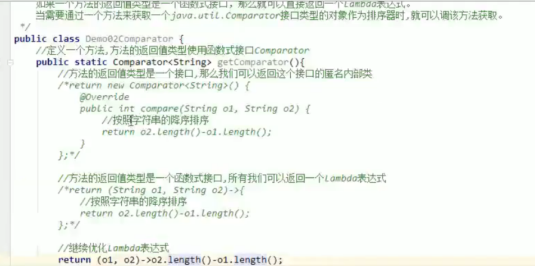
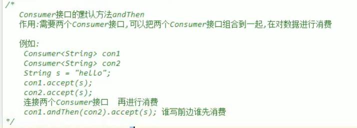

# jdk1.8-
learn 1.8  new feature
通过本篇文章了解1.8新特性的用法

----

函数式接口
一、学习目标

1. 能够使用@FunctionalInterface注解
2. 能够自定义无参无返回函数式接口
3. 能够自定义有参有返回函数式接口
4. 能够理解Lambda延迟执行的特点
5. 能够使用Lambda作为方法的参数
6. 能够使用Lambda作为方法的返回值
7. 能够使用Supplier函数式接口
8. 能够使用Consumer函数式接口
9. 能够使用Function函数式接口
10. 能够使用Predicate函数式接口

本节知识点
01_今日内容介绍		 
02_函数式接口的概念&函数式接口的定义
03_函数式接口的使用
04_性能浪费的日志案例

​		

 函数式接口的概念&函数式接口的定义
1.2.1知识概述
有且仅有一个抽象方法的接口 当然可以包含其他方法(默认,静态私有)

1.2.3总结与补充
@FunctionalInterface 注解来检测接口是否是一个函数式接口
是 编译成功 否编译失败
函数式接口在Java中是指：有且仅有一个抽象方法的接口。

 函数式接口的使用

1.3.3总结与补充
一般可以作为方法的参数和返回值类型
1方法的参数是一个接口,可以传递接口的实现类对象

	2. 匿名内部类
	3. Lambda

​	

####  性能浪费的日志案例

1.4.1知识概述
案例演示, 引入Lambda延迟执行

 Thread类的常用方法_设置线程名称的方法
1.5.1知识概述
setName();
new Thread(“线程名字”);

1.5.3总结与补充
public Thread(String name) :分配一个指定名字的新的线程对象
public Thread(Runnable target,String name) :分配一个带有指定目标新的线程对象并指定名字

public void setName(String name) : 为线程对象设置名字.

第二堂课
本节知识点：
05_使用Lambda优化日志案例
06_函数式接口作为方法的参数案例
07_函数式接口作为方法的返回值类型案例

使用Lambda优化日志案例
2.1.1知识概述
使用Lambda优化日志案例

函数式接口作为方法的参数案例
2.2.1知识概述
使用Lambda开启线程-> Runnable

函数式接口作为方法的返回值类型案例
2.3.1知识概述
函数式接口Comparator的使用

常用的函数式接口
本节知识点：
08_常用的函数式接口_Supplier接口
09_常用的函数式接口_Supplier接口练习_求数组元素最大值
10_常用的函数式接口_Consumer接口
11_常用的函数式接口_Consumer接口的默认方法andThen

常用的函数式接口_Supplier接口
3.1.1知识概述
生产型接口Supplier

3.1.2视频详情

3.1.3总结与补充
java.util.function.Supplier<T> 接口仅包含一个无参的方法： T get() 。用来获取一个泛型参数指定类型的对象数据。由于这是一个函数式接口，这也就意味着对应的Lambda表达式需要“对外提供”一个符合泛型类型的对象数据。

常用的函数式接口_Supplier接口练习_求数组元素最大值
3.2.1知识概述
函数式接口 supplier接口 生产型接口

使用 Supplier 接口作为方法参数类型，通过Lambda表达式求出int数组中的最大值

常用的函数式接口_Consumer接口
3.3.1知识概述
消费型接口Consumer

3.3.3总结与补充
	java.util.function.Consumer<T> 接口则正好与Supplier接口相反，它不是生产一个数据，而是消费一个数据，其数据类型由泛型决定

Consumer 接口中包含抽象方法 void accept(T t) ，意为消费一个指定泛型的数据

常用的函数式接口_Consumer接口的默认方法andThen
3.3.1知识概述
如果一个方法的参数和返回值全都是 Consumer 类型，那么就可以实现效果：消费数据的时候，首先做一个操作，然后再做一个操作，实现组合

使用andThen 把两个消费型接口连接到一起,再消费数据

4.1 常用的函数式接口_Consumer接口练习_字符串拼接输出
4.1.1知识概述
常用的函数式接口_Consumer接口练习_字符串拼接输出
先定义函数式接口,对消费字符串做处理

然后再主方法里里消费数据

4.2 常用的函数式接口_Predicate接口
4.2.1知识概述
常用的函数式接口_Predicate接口

4.2.3总结与补充
	有时候我们需要对某种类型的数据进行判断，从而得到一个boolean值结果。这时可以使用java.util.function.Predicate<T> 接口	

简单使用predicate接口 判断字符串长度是大于5

4.3 常用的函数式接口_Predicate接口_默认方法and
4.3.1知识概述
常用的函数式接口_Predicate接口_默认方法and

利用and 连接两个判断条件 

4.4 常用的函数式接口_Predicate接口_默认方法or&negate
4.4.1知识概述
Or : 或者
negate : 非

利用negate 取反,字符串长度大于5,返回false

4.4.3总结与补充
与 and 的“与”类似，默认方法 or 实现逻辑关系中的“或”
negate - > 非

5.1 常用的函数式接口_Predicate接口练习_集合信息筛选
5.1.1知识概述
Predicate案例

先写一个过滤方法,传递Predicate接口来过滤判断条件

然后再主方法调用

5.2 常用的函数式接口_Function接口
5.2.1知识概述
转换型接口Function

5.2.3总结与补充
	java.util.function.Function<T,R> 接口用来根据一个类型的数据得到另一个类型的数据，前者称为前置条件，后者称为后置条件

Function 接口中最主要的抽象方法为： R apply(T t) ，根据类型T的参数获取类型R的结果。使用的场景例如：将 String 类型转换为 Integer 类型。

5.3 常用的函数式接口_Function接口_默认方法andThen
5.3.1知识概述
Function 接口中有一个默认的 andThen 方法，用来进行组合操作。
需求:

实现: 通过两个Function接口 的andThen连接 先将字符串转为INTEGER ,然后再转为String 返回

5.4  常用的函数式接口_Function接口练习_自定义函数模型拼接
5.3.1知识概述
Function接口练习

5.3.3总结与补充
	请使用 Function 进行函数模型的拼接，按照顺序需要执行的多个函数操作为：
	String str = "赵丽颖,20";

	1. 将字符串截取数字年龄部分，得到字符串；
	2. 将上一步的字符串转换成为int类型的数字；
	3. 将上一步的int数字累加100，得到结果int数字

